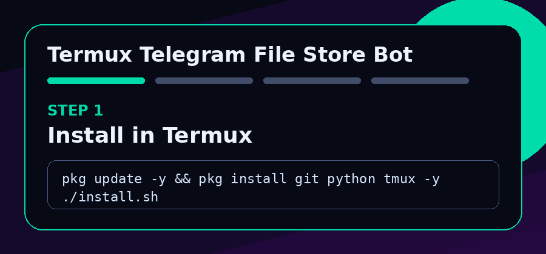
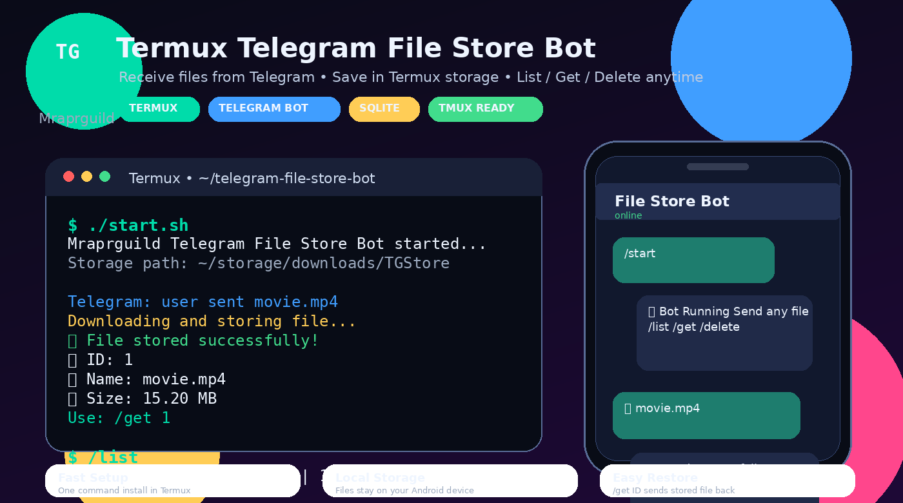

<p align="center">
  
</p>

<h1 align="center">📁 Termux Telegram File Store Bot</h1>

<p align="center">
  <b>Large-file Telegram file-storage bot for Android Termux.</b><br>
  Send files to your Telegram bot, save them on your phone, manage them with commands, and restore them anytime.
</p>

<p align="center">
  
  
  
  
</p>

<p align="center">
  <b>Created by Mraprguild</b> • <b>Termux Ready</b> • <b>Large File Fix</b> • <b>tmux Background Support</b>
</p>

---

## ✅ Large File Error Fixed

Old error:

```text
❌ File store failed.
Error: File is too big
```

This build fixes that by using **Telethon / MTProto** instead of the normal HTTP Bot API `getFile` download path.

The normal Telegram Bot API `getFile` download path has a 20 MB download limit. This project uses Telegram client API style access with `API_ID`, `API_HASH`, and `BOT_TOKEN`, so large files can be saved in Termux storage.

---

## 🎬 Animated Demo

<p align="center">
  
</p>

---

## 📸 Screenshot Preview

<p align="center">
  
</p>

---

## ✨ Main Features

| Feature | Details |
|---|---|
| ✅ Large file mode | Uses MTProto/Telethon to avoid normal Bot API `getFile` download limit |
| ✅ Telegram bot login | Uses `API_ID`, `API_HASH`, and `BOT_TOKEN` |
| ✅ File storage | Stores Telegram files inside Termux storage |
| ✅ SQLite database | Saves file ID, name, type, size, path, and owner |
| ✅ File restore | Use `/get ID` to send saved files back to Telegram |
| ✅ File delete | Use `/delete ID` to remove saved files |
| ✅ File list | Use `/list` to see latest stored files |
| ✅ Storage stats | Use `/stats` to check saved file count and storage folder |
| ✅ Multiple media types | Documents, photos, videos, audio, voice, stickers, animations |
| ✅ Android friendly | Works in Termux on Android phones |
| ✅ Background mode | `tmux` support keeps bot running after closing session |

---

## 🧠 How It Works

```text
Telegram User
    │
    │ sends document / photo / video / audio
    ▼
Telethon / MTProto Client
    │
    │ downloads large media
    ▼
Termux Storage Folder
    │
    ├── ~/storage/downloads/TGStore/file_name.ext
    │
    ▼
SQLite Database
    │
    ├── file ID
    ├── original name
    ├── saved path
    ├── file size
    └── user ID
```

---

## 📂 Project Structure

```text
termux-telegram-file-store-bot/
├── assets/
│   ├── banner.svg
│   ├── demo.gif
│   └── screenshot.png
├── bot.py
├── install.sh
├── start.sh
├── run-tmux.sh
├── requirements.txt
├── .env.example
├── .gitignore
├── LICENSE
└── README.md
```

---

## 📁 Storage Location

After running `termux-setup-storage`, files are stored here:

```bash
~/storage/downloads/TGStore
```

Database file:

```bash
~/telegram-file-store-bot/files.db
```

If Android shared storage is not available, the bot falls back to:

```bash
~/telegram-file-store-bot/TGStore
```

---

## 🚀 One-Command Termux Install

```bash
pkg update -y && pkg upgrade -y
pkg install git -y
git clone https://github.com/Mraprguild/termux-telegram-file-store-bot.git
cd termux-telegram-file-store-bot
chmod +x install.sh start.sh run-tmux.sh
./install.sh
```

---

## 🔑 Required Telegram Values

You need **3 values**:

| Value | Where to get it |
|---|---|
| `BOT_TOKEN` | Telegram `@BotFather` |
| `API_ID` | https://my.telegram.org/apps |
| `API_HASH` | https://my.telegram.org/apps |

### 1. Create Bot Token

1. Open Telegram.
2. Search **@BotFather**.
3. Send:

```text
/newbot
```

4. Create bot name and username.
5. Copy the bot token.

### 2. Create Telegram API ID and API Hash

1. Open `https://my.telegram.org/apps`.
2. Login with your Telegram number.
3. Create a new application.
4. Copy `api_id` and `api_hash`.

---

## ⚙️ Add Credentials in Termux

Open env file:

```bash
nano ~/telegram-file-store-bot/.env
```

Paste your details:

```bash
API_ID=123456
API_HASH=your_api_hash_here
BOT_TOKEN=1234567890:AAExampleBotTokenHere
```

Save:

```text
CTRL + X
Y
ENTER
```

---

## ▶️ Start Bot

```bash
./start.sh
```

Expected output:

```text
Mraprguild File Store Bot starting...
Storage: /data/data/com.termux/files/home/storage/downloads/TGStore
Large-file mode: Telethon / MTProto
Bot started successfully.
```

Now open your Telegram bot and send any file.

---

## 🔁 Run Bot in Background with tmux

Start background session:

```bash
./run-tmux.sh
```

Detach from tmux:

```text
CTRL + B
D
```

Open session again:

```bash
tmux attach -t tgstore
```

Stop bot:

```text
CTRL + C
```

---

## 🤖 Bot Commands

| Command | Details |
|---|---|
| `/start` | Start bot |
| `/help` | Show help |
| `/list` | Show stored files |
| `/get ID` | Send stored file back |
| `/delete ID` | Delete stored file |
| `/stats` | Show storage stats |

Example:

```text
/get 3
/delete 3
```

---

## 🛠️ Fix Common Errors

### Error: File is too big

Use this updated MTProto version. The old `python-telegram-bot` Bot API version used `getFile`, which fails for big files.

### Missing API_ID / API_HASH / BOT_TOKEN

Edit credentials:

```bash
nano ~/telegram-file-store-bot/.env
```

Add:

```bash
API_ID=123456
API_HASH=your_api_hash_here
BOT_TOKEN=your_bot_token_here
```

### Could not resolve host / Network error

```bash
pkg install dnsutils -y
ping api.telegram.org
termux-change-repo
```

### Permission denied storage

```bash
termux-setup-storage
```

Then allow storage permission in Android popup.

### Bot not running after closing Termux

Use tmux:

```bash
./run-tmux.sh
```

---

## 🔒 Security Notes

- Do not upload `.env` to public GitHub.
- Do not share your bot token.
- Do not share your API hash.
- Keep enough free phone storage for large files.
- Use the bot for your own legal files only.

---

## 🧩 GitHub Upload Commands

```bash
git init
git add .
git commit -m "Initial large-file Termux Telegram file store bot"
git branch -M main
git remote add origin https://github.com/Mraprguild/termux-telegram-file-store-bot.git
git push -u origin main
```

---

## 📌 Roadmap

- [ ] Admin-only mode
- [ ] User quota limit
- [ ] Search by file name
- [ ] Auto folder by user ID
- [ ] Gofile/Filepress cloud backup
- [ ] Web dashboard
- [ ] QR login setup helper

---

## 👤 Author

**Created by Mraprguild**

Built for Termux, Telegram, and Android file storage automation.
